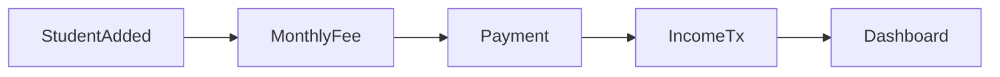

# EduCore - School Management SaaS — Project Roadmap
> An **intermediate-level**, multi-tenant School Management SaaS for small private schools in Bangladesh.  
> **Stack:** Next.js (App Router) + TypeScript | Express.js + MongoDB | JWT | Vercel + Render/Railway

- Live Link: https://my-school-software.vercel.app/
- Backend Server: https://school-erp-backend-service.onrender.com/

---

## Table of Contents

1. [Project Overview](#1-project-overview)
2. [Product Vision](#2-product-vision)
3. [Target Users](#3-target-users)
4. [Core Features (MVP)](#4-core-features-mvp)
5. [Future Features (Phase 2+)](#5-future-features-phase-2)
6. [Technical Architecture Overview](#6-technical-architecture-overview)
7. [Folder Structure](#7-folder-structure)
8. [Database Design Overview](#8-database-design-overview)
9. [System Flow](#9-system-flow)
10. [Page Structure (Frontend Navigation)](#10-page-structure-frontend-navigation)
11. [API Module Breakdown](#11-api-module-breakdown)
12. [Step-by-Step Development Roadmap](#12-step-by-step-development-roadmap)
13. [Git Commit Strategy](#13-git-commit-strategy)
14. [Development Phases](#14-development-phases)
15. [Suggested Order of Implementation](#15-suggested-order-of-implementation)
16. [SaaS Multi-Tenant Strategy](#16-saas-multi-tenant-strategy)
17. [Subscription Structure](#17-subscription-structure)
18. [Environment Variables](#18-environment-variables)
19. [Deployment Plan Overview](#19-deployment-plan-overview)

### Module quick reference (7 main modules)

| # | Module | Objective |
|---|--------|-----------|
| 1 | Authentication & School Setup | School registration (name, admin, email, password, phone, subscription plan); login (email + password, JWT, role Admin); later Teacher. |
| 2 | Dashboard | One-screen overview: total students, today’s attendance %, month income/expense, net balance, total due fees, recent transactions (5), recent payments (5). |
| 3 | Student Management | Add/edit/delete students; search; filter by class/section; full fields (guardian phone, monthly fee, admission date, status). |
| 4 | Attendance Management | Daily attendance (date, class filter, present/absent); attendance report (monthly view, per-student %); export (future). |
| 5 | Fee & Due Management | Monthly fee generation per student; record payment (auto income transaction); due list (unpaid/partial, filters, summary). |
| 6 | Income–Expense (Finance) | Add income/expense with categories; monthly finance summary (total income, expense, net balance, list). |
| 7 | Reports | Monthly collection report; income vs expense (month-wise); attendance summary; visual, not complex tables. |

*Phase 0 (foundation) is already in place: project setup, backend auth, frontend auth, dashboard layout.*

---

## 1. Project Overview

| Item | Description |
|------|-------------|
| **Product** | Multi-tenant School Management SaaS (intermediate level) |
| **Scope** | Monthly fee generation, due management, attendance, income/expense with categories, dashboard metrics, simple reports |
| **Philosophy** | Operational and clean — not a full ERP; no advanced accounting; everything connected (student → fee → payment → income → dashboard) |
| **Deployment** | Frontend: Vercel \| Backend: Render or Railway \| DB: MongoDB Atlas |
| **Auth** | JWT-based authentication (email + password); role: Admin (MVP), later Teacher |
| **Tenancy** | Data isolation per school via `school_id` |

---

## 2. Product Vision

- **Primary:** Give small private schools in Bangladesh a single, affordable tool to manage students, monthly fees, due list, attendance, and basic finances.
- **Experience:** One-screen dashboard, monthly fee engine, record payment → auto income transaction, due list with filters, monthly finance summary, simple visual reports; mobile-friendly.
- **Growth path:** Start with 7 modules (auth, dashboard, students, attendance, fee & due, finance, reports); later add Teacher role, SMS, parent portal, subscription enforcement (Free 50 students / Pro unlimited).

---

## 3. Target Users

| Role | Description |
|------|-------------|
| **School Admin** | Owner/principal; MVP role; manages school profile, subscription, and global settings. |
| **Teacher** | Later: mark attendance; limited access to students/fees. |
| **Parent** (future) | View child’s attendance and fee status (Phase 2+). |

---

## 4. Core Features (MVP)

- **School registration** — School name, admin name, email, password, phone, subscription plan (default Free).
- **Login** — Email + password, JWT; role Admin (MVP).
- **Dashboard** — One screen: total students, today’s attendance %, this month total income, this month total expense, net balance, total due fees, recent transactions (last 5), recent payments (last 5).
- **Student management** — Add, edit, delete, search, filter by class/section; fields: full name, class, section, roll, guardian name, guardian phone, monthly fee, admission date, status (active/inactive).
- **Attendance** — Daily attendance page (select date, default today; filter by class; mark present/absent); attendance report (monthly view, per-student %); export (future).
- **Fee & due management** — System auto-creates monthly fee record per student; record payment (select student + month, amount paid; auto due; on save → auto-create income transaction); due list page (unpaid/partial, filters: this month, overdue, class; summary: total due amount, number of unpaid students).
- **Income–expense (Finance)** — Add income (date, category: Fee/Admission/Fine/Other, amount, note); add expense (date, category: Salary/Rent/Utility/Exam/Other, amount, note); monthly finance summary (select month → total income, total expense, net balance, list of transactions). Simple math: Net Balance = Total Income − Total Expense.
- **Reports** — Monthly collection report (expected, collected, due); income vs expense (month-wise); attendance summary (monthly %). Visual, not complex tables.
- **Settings** — Users and school profile (foundation).

---

## 5. Future Features (Phase 2+)

- **Teacher role** — Mark attendance; limited access.
- **Parent portal** — View attendance, fee status, receipts.
- **SMS/notification** — Fee reminders, attendance (Pro plan).
- **Advanced reports** — Pro plan.
- **Export** — Attendance report, finance (e.g. CSV/PDF).
- **Subscription enforcement** — Free: 50 students; Pro: unlimited (see [§17](#17-subscription-structure)).
- **Optional:** receipts/PDF, basic analytics, multi-branch support.

---

## 6. Technical Architecture Overview

```
┌─────────────────────────────────────────────────────────────────────────┐
│                           CLIENT (Browser / Mobile)                      │
│                     Next.js App Router + TypeScript                      │
└─────────────────────────────────────────────────────────────────────────┘
                                      │
                                      │ HTTPS / REST API
                                      ▼
┌─────────────────────────────────────────────────────────────────────────┐
│                    BACKEND (Render / Railway)                            │
│                    Express.js + JWT Middleware                           │
│  ┌──────────┐ ┌──────────┐ ┌──────────┐ ┌──────────┐ ┌──────────────┐  │
│  │   Auth   │ │  Schools │ │ Students │ │   Fees   │ │  Attendance  │  │
│  └──────────┘ └──────────┘ └──────────┘ └──────────┘ └──────────────┘  │
│  ┌──────────────────┐                                                    │
│  │ Income / Expense  │                                                    │
│  └──────────────────┘                                                    │
└─────────────────────────────────────────────────────────────────────────┘
                                      │
                                      │ Mongoose
                                      ▼
┌─────────────────────────────────────────────────────────────────────────┐
│                        MongoDB Atlas                                      │
│            (Single cluster; tenant isolation via school_id)               │
└─────────────────────────────────────────────────────────────────────────┘
```

- **Frontend:** Next.js 14+ App Router, TypeScript, server components where useful, client components for forms and interactivity.
- **Backend:** Express.js, Mongoose, JWT in `Authorization: Bearer <token>`, `school_id` on every tenant-scoped request.
- **Multi-tenancy:** Same DB; all tenant-scoped queries filter by `school_id` (and optionally `userId`/role).

---

## 7. Folder Structure

### Frontend (Next.js)

```
frontend/
├── app/
│   ├── (auth)/                    # Auth routes (login, register)
│   │   ├── login/
│   │   └── register/
│   ├── (dashboard)/               # Protected dashboard layout
│   │   ├── layout.tsx
│   │   ├── page.tsx               # Dashboard home
│   │   ├── students/
│   │   ├── attendance/
│   │   ├── fees/                  # Fee & due list, record payment
│   │   ├── finance/               # Income/expense, monthly summary
│   │   ├── reports/               # Collection, income vs expense, attendance summary
│   │   └── settings/
│   ├── layout.tsx
│   └── globals.css
├── components/
│   ├── ui/
│   ├── layout/
│   ├── forms/
│   └── features/
├── lib/
├── hooks/
├── types/
├── public/
└── package.json
```

### Backend (Express)

```
backend/
├── src/
│   ├── config/
│   │   └── db.js
│   ├── middleware/
│   │   ├── auth.js
│   │   └── tenant.js
│   ├── models/
│   │   ├── User.js
│   │   ├── School.js
│   │   ├── Student.js
│   │   ├── Fee.js                 # Monthly fee per student (total_fee, paid_amount, due_amount, status)
│   │   ├── Attendance.js
│   │   └── Transaction.js        # Income/expense with category, related_fee_id optional
│   ├── routes/
│   │   ├── auth.js
│   │   ├── schools.js
│   │   ├── users.js
│   │   ├── students.js
│   │   ├── fees.js                # List, generate month, record payment (→ income tx)
│   │   ├── attendance.js
│   │   ├── transactions.js
│   │   └── dashboard.js
│   ├── utils/
│   ├── app.js
│   └── server.js
├── .env.example
└── package.json
```

---

## 8. Database Design Overview

- **Single MongoDB Atlas cluster.** All collections use `school_id` (ObjectId ref to `schools`) for tenant isolation. Index key compound: `(school_id, ...)` for list/filter queries.

### Core Collections

| Collection | Purpose | Key Fields |
|------------|---------|------------|
| **schools** | Tenant; one per school | `name`, `email` (optional school-level contact), `subscription_plan`, `subscription_expiry`, `created_at` |
| **users** | Staff/admins; belong to a school | `school_id`, `email`, `password_hash`, `name`, `phone`, `role` (Admin MVP; later Teacher) |
| **students** | Students per school | `school_id`, `name`, `class`, `section`, `roll`, `guardian_name`, `guardian_phone`, `monthly_fee`, `admission_date`, `status` (active/inactive), `created_at` |
| **attendance** | Daily attendance records | `school_id`, `student_id`, `date`, `status` (present/absent) |
| **fees** | One document per student per month | `school_id`, `student_id`, `month` (e.g. YYYY-MM), `total_fee`, `paid_amount`, `due_amount`, `status` (paid/partial/unpaid), `created_at` |
| **transactions** | Income/expense ledger | `school_id`, `type` (income/expense), `category`, `amount`, `date`, `note`, `related_fee_id` (optional, for fee payments) |

- **Indexes:** `school_id` (and often `school_id + date`, `school_id + student_id`, `school_id + month`, etc.) on every tenant-scoped collection.
- **Monthly fee generation:** A job or on-demand endpoint creates/updates `fees` documents per active student per month from `students.monthly_fee`. Recording a payment updates the corresponding `fees` document (`paid_amount`, `due_amount`, `status`) and creates an income `Transaction` with `category: 'Fee'` and `related_fee_id` set.

**Transaction categories:**

- **Income:** Fee, Admission, Fine, Other  
- **Expense:** Salary, Rent, Utility, Exam, Other  

---

## 9. System Flow

- **Student added** → School creates/edits student with `monthly_fee`, `admission_date`, etc.
- **Monthly fee generated** → System creates or updates a `fees` document per active student per month from `students.monthly_fee`.
- **Payment recorded** → User selects student + month, enters amount; backend updates the `fees` document (`paid_amount`, `due_amount`, `status`) and **auto-creates** an income `Transaction` (category Fee, `related_fee_id` set).
- **Dashboard and monthly summary updated** → Stats (total due, this month income/expense, net balance) and lists (recent transactions, recent payments) reflect the new data.



---

## 10. Page Structure (Frontend Navigation)

- **Dashboard** — Single screen with all metrics and recent lists.
- **Students** — List, search, filter (class/section), add/edit/delete.
- **Attendance** — Daily page (date, class filter, mark present/absent); report (monthly, per-student %).
- **Fees** — Due list (filters, summary); record payment; optional fee-generation trigger.
- **Finance** — Add income/expense (category, amount, date, note); monthly finance summary.
- **Reports** — Monthly collection; income vs expense; attendance summary.
- **Settings** — School profile, users (foundation).

Layout: clean sidebar for desktop; mobile uses a drawer (already implemented). Nav labels can match the above (Dashboard, Students, Attendance, Fees, Finance, Reports, Settings).

---

## 11. API Module Breakdown

| Module | Base Path | Purpose |
|--------|-----------|--------|
| Auth | `/api/auth` | Register (school name, admin name, email, password, **phone**, **subscription_plan**); login; returns JWT and user/school info. |
| Schools | `/api/schools` | CRUD school (create during signup); get current school; PATCH for `subscription_plan`, `subscription_expiry` if needed. |
| Users | `/api/users` | CRUD users for current school; list by role. |
| Students | `/api/students` | CRUD students; list with search (name/roll) and filter (class, section); fields include `guardian_phone`, `monthly_fee`, `admission_date`, `status`. |
| Fees | `/api/fees` | GET list (by school, month, student; for due list: status unpaid/partial, filters). POST pay: body student_id, month, amount; updates Fee; creates income Transaction. Fee generation: e.g. POST /api/fees/generate-month. |
| Attendance | `/api/attendance` | Submit daily attendance; get by date/class/student; GET report (monthly view, per-student %). |
| Transactions | `/api/transactions` | CRUD; categories (income: Fee, Admission, Fine, Other; expense: Salary, Rent, Utility, Exam, Other); list by date range, type, category; optional monthly summary. |
| Dashboard | `/api/dashboard` | GET returns: total students, today attendance %, this month income/expense, net balance, total due fees, recent transactions (5), recent payments (5). |
| Reports | `/api/reports` | GET monthly collection (expected, collected, due); GET income vs expense (month-wise); GET attendance summary (monthly %). |

All tenant-scoped routes must validate JWT and enforce `school_id` from token (or explicit header/param where needed). Use consistent error codes and JSON shape (e.g. `{ success, data?, error? }`).

---

## 12. Step-by-Step Development Roadmap

The roadmap is split into **small modules** (see [§14](#14-development-phases)). Each module is 1–3 days, with a clear objective, backend/frontend/database tasks, and a suggested git commit. Order of implementation is in [§15](#15-suggested-order-of-implementation).

---

## 13. Git Commit Strategy

- **One feature or sub-feature per commit;** avoid large “everything” commits.
- **Commit after each module** (or after each logical sub-task within a module).
- **Message format:** `[Module N] Short description` or `feat(area): description`.
- **Examples:**
  - `[Module 1] Add Next.js and Express projects with base config`
  - `[Module 2] Add JWT auth endpoints and middleware`
  - `feat(students): add student list API with school_id filter`
- Keep commits buildable and runnable so you can bisect or revert easily.

---

## 14. Development Phases

Each phase is a set of modules. Each module is independently buildable and committable (1–3 days).

**Phase 0 (already done):** Project setup, backend auth, frontend auth, dashboard layout — foundation in place. The sections below start from **Module 1 (Auth & School Setup)** enhancements and continue in order.

---

### MODULE 1: Authentication & School Setup

#### 1.1 School registration (phone, subscription plan)

| Item | Details |
|------|--------|
| **Objective** | Register school with admin name, email, password, **phone**, **subscription_plan** (default Free). |
| **What to build** | Extended register payload; School model: `subscription_plan`, `subscription_expiry`; User model: `phone`. |
| **Backend tasks** | Extend School (subscription_plan, subscription_expiry), User (phone); register accepts phone, subscription_plan; return school + user. |
| **Frontend tasks** | Register form: add phone field; optional subscription plan dropdown (default Free). |
| **Database changes** | `schools`: add subscription_plan, subscription_expiry; `users`: add phone. |
| **Git commit example** | `feat(auth): add phone and subscription_plan to school registration` |

#### 1.2 Login

| Item | Details |
|------|--------|
| **Objective** | Login unchanged: email + password, JWT, role Admin; later Teacher. |
| **What to build** | No change if already implemented. |
| **Backend tasks** | Login returns JWT and user/school; role in token. |
| **Frontend tasks** | None. |
| **Database changes** | None. |
| **Git commit example** | (Already done in Phase 0) |

---

### MODULE 2: Dashboard

#### 2.1 Dashboard stats API

| Item | Details |
|------|--------|
| **Objective** | Single endpoint returning all dashboard metrics. |
| **What to build** | GET `/api/dashboard`: total students, today attendance %, this month total income, this month total expense, net balance, total due fees, recent transactions (5), recent payments (5). |
| **Backend tasks** | Aggregate from students, attendance, fees, transactions; all scoped by school_id. |
| **Frontend tasks** | None. |
| **Database changes** | None (queries only). |
| **Git commit example** | `feat(dashboard): add dashboard stats API with all metrics` |

#### 2.2 Dashboard UI

| Item | Details |
|------|--------|
| **Objective** | One screen with all metrics and recent lists. |
| **What to build** | Cards for students, attendance %, income, expense, net balance, due fees; lists: recent transactions (5), recent payments (5). |
| **Frontend tasks** | Call dashboard API; render cards and lists; responsive layout; loading/error states. |
| **Backend tasks** | None. |
| **Database changes** | None. |
| **Git commit example** | `feat(dashboard): dashboard home with all metrics and recent lists` |

---

### MODULE 3: Student Management

#### 3.1 Student backend (extended model, search, filter)

| Item | Details |
|------|--------|
| **Objective** | Full student API with guardian_phone, monthly_fee, admission_date, status; search and filter. |
| **What to build** | Student model extended; list with search (name/roll) and filter (class, section). |
| **Backend tasks** | Extend Student: guardian_phone, monthly_fee, admission_date, status; list API with query params. |
| **Frontend tasks** | None. |
| **Database changes** | students: guardian_phone, monthly_fee, admission_date, status; indexes as needed. |
| **Git commit example** | `feat(students): extend model and add search/filter to list API` |

#### 3.2 Student UI (full form, search, filter)

| Item | Details |
|------|--------|
| **Objective** | Add/edit/delete students; search; filter by class/section; form with full field set. |
| **What to build** | Students page: list, filters, add/edit dialog, delete confirm; form fields: name, class, section, roll, guardian_name, guardian_phone, monthly_fee, admission_date, status. |
| **Frontend tasks** | Use students API; form validation; filters and search. |
| **Backend tasks** | None. |
| **Database changes** | None. |
| **Git commit example** | `feat(students): student form with full fields and filters` |

---

### MODULE 4: Attendance

#### 4.1 Daily attendance

| Item | Details |
|------|--------|
| **Objective** | Select date (default today), filter by class, mark present/absent. |
| **What to build** | Attendance API: submit for date, get by date/class; daily attendance page. |
| **Backend tasks** | Attendance model and routes; POST bulk; GET by date, class. |
| **Frontend tasks** | Date picker; class filter; student list with present/absent; submit. |
| **Database changes** | attendance collection; indexes (school_id, date), (school_id, student_id, date). |
| **Git commit example** | `feat(attendance): daily attendance API and UI` |

#### 4.2 Attendance report

| Item | Details |
|------|--------|
| **Objective** | Monthly view; per-student attendance %; export (future). |
| **What to build** | GET report (monthly view, per-student %); report page. |
| **Backend tasks** | GET /api/attendance/report?month=; aggregate by student. |
| **Frontend tasks** | Report page: select month; show table/list with %. |
| **Database changes** | None. |
| **Git commit example** | `feat(attendance): attendance report API and UI` |

---

### MODULE 5: Fee & Due Management

#### 5.1 Monthly fee generation

| Item | Details |
|------|--------|
| **Objective** | Create/update `Fees` per student per month from students.monthly_fee. |
| **What to build** | Job or endpoint (e.g. POST /api/fees/generate-month) that creates/updates fee documents for active students for a given month. |
| **Backend tasks** | Fee model (school_id, student_id, month, total_fee, paid_amount, due_amount, status); generate-month logic. |
| **Frontend tasks** | Optional: button to trigger generation for current month. |
| **Database changes** | fees collection; indexes (school_id, month), (school_id, student_id, month). |
| **Git commit example** | `feat(fees): monthly fee generation endpoint and model` |

#### 5.2 Record payment (update Fee + auto income Transaction)

| Item | Details |
|------|--------|
| **Objective** | Select student + month, amount paid; update Fee; create income Transaction with related_fee_id. |
| **What to build** | POST /api/fees/pay (or /api/fees/:id/pay): body student_id, month, amount; update Fee (paid_amount, due_amount, status); create Transaction (type income, category Fee, related_fee_id). |
| **Backend tasks** | Pay endpoint; transaction creation on pay. |
| **Frontend tasks** | Record payment form: student, month, amount; call pay API. |
| **Database changes** | transactions collection; related_fee_id optional. |
| **Git commit example** | `feat(fees): record payment and auto-create income transaction` |

#### 5.3 Due list API and UI

| Item | Details |
|------|--------|
| **Objective** | List unpaid/partial fees; filters (this month, overdue, class); summary (total due, count unpaid). |
| **What to build** | GET /api/fees?status=unpaid or partial and filters; due list page with summary and table. |
| **Backend tasks** | List fees with status and filter params; return summary (total due, count). |
| **Frontend tasks** | Due list page: filters, summary cards, table of dues. |
| **Database changes** | None. |
| **Git commit example** | `feat(fees): due list API and UI with filters and summary` |

---

### MODULE 6: Income–Expense (Finance)

#### 6.1 Transactions API (CRUD, categories)

| Item | Details |
|------|--------|
| **Objective** | CRUD transactions; categories: income (Fee, Admission, Fine, Other), expense (Salary, Rent, Utility, Exam, Other). |
| **What to build** | Transaction model and routes; list by date range, type, category. |
| **Backend tasks** | Transaction model (school_id, type, category, amount, date, note, related_fee_id); CRUD; list with filters. |
| **Frontend tasks** | None. |
| **Database changes** | transactions collection (if not done in 5.2). |
| **Git commit example** | `feat(transactions): CRUD and categories for income/expense` |

#### 6.2 Transaction UI (add income/expense)

| Item | Details |
|------|--------|
| **Objective** | Add income or expense with date, category, amount, note. |
| **What to build** | Finance page: form (type, category, amount, date, note); list with filters. |
| **Frontend tasks** | Add form; category dropdowns; list transactions. |
| **Backend tasks** | None. |
| **Database changes** | None. |
| **Git commit example** | `feat(finance): add income/expense UI with categories` |

#### 6.3 Monthly finance summary

| Item | Details |
|------|--------|
| **Objective** | Select month; total income, total expense, net balance; list transactions. |
| **What to build** | GET summary by month; UI: month picker, summary cards, transaction list. |
| **Backend tasks** | GET /api/transactions/summary?month= or similar. |
| **Frontend tasks** | Finance summary section: month selector; totals; list. |
| **Database changes** | None. |
| **Git commit example** | `feat(finance): monthly summary API and UI` |

---

### MODULE 7: Reports

#### 7.1 Monthly collection report

| Item | Details |
|------|--------|
| **Objective** | Total expected, collected, due for the month. |
| **What to build** | GET /api/reports/collection?month=; report page. |
| **Backend tasks** | Aggregate from fees for month. |
| **Frontend tasks** | Reports page: collection report; month selector. |
| **Database changes** | None. |
| **Git commit example** | `feat(reports): monthly collection report` |

#### 7.2 Income vs expense report

| Item | Details |
|------|--------|
| **Objective** | Month-wise summary of income and expense. |
| **What to build** | GET /api/reports/income-expense (e.g. by month); UI. |
| **Backend tasks** | Aggregate transactions by month and type. |
| **Frontend tasks** | Income vs expense chart or table by month. |
| **Database changes** | None. |
| **Git commit example** | `feat(reports): income vs expense report` |

#### 7.3 Attendance summary report

| Item | Details |
|------|--------|
| **Objective** | Monthly attendance % (school or per class). |
| **What to build** | GET /api/reports/attendance-summary?month=; UI. |
| **Backend tasks** | Aggregate attendance by month. |
| **Frontend tasks** | Attendance summary on reports page. |
| **Database changes** | None. |
| **Git commit example** | `feat(reports): attendance summary report` |

---

## 15. Suggested Order of Implementation

- **Phase 0 (done):** Project setup, backend auth, frontend auth, dashboard layout.
- **Then:** Implement in order **1 → 2 → 3 → 4 → 5 → 6 → 7** (Auth & School Setup, Dashboard, Students, Attendance, Fee & Due, Finance, Reports).

Alternatively, build data modules first so the dashboard has real data: **1 → 3 → 4 → 5 → 6 → 2 → 7** (dashboard after students, attendance, fees, transactions). If you follow strict 1–7, the dashboard (Module 2) can use stubbed or partial data until later modules exist; state this in the README or when implementing.

---

## 16. SaaS Multi-Tenant Strategy

- **Model:** Single database, tenant isolation by `school_id` (shared schema, row-level isolation).
- **How it works:**
  - Every tenant-scoped document has `school_id` (ObjectId ref to `schools`).
  - On login, JWT payload includes `userId` and `schoolId` (and optionally `role`).
  - Backend middleware sets `req.schoolId` from token; every list/create/update/delete filters or sets `school_id`.
- **Security:** Never trust client for `school_id`; always use token (or server-side lookup). Validate that the user belongs to that school.
- **Scalability:** Index all tenant queries on `school_id` first; for very large scale, consider sharding or separate DB per tenant later (out of MVP scope).

---

## 17. Subscription Structure

| Tier | Student limit | Features |
|------|----------------|----------|
| **Free** | 50 students | Basic features; no SMS. |
| **Pro** | Unlimited | SMS reminder (future); advanced reports. |

- **Schema:** `schools.subscription_plan` (e.g. `free`, `pro`), `schools.subscription_expiry` (optional, for renewal).
- **Enforcement:** On school create/register, set default `subscription_plan` to `free`. On student create, for Free plan check current student count and reject if at or above 50; Pro has no limit.
- **Billing:** No payment integration in MVP; plan and expiry fields are for future Stripe or manual upgrade flow.

---

## 18. Environment Variables

### Backend (`.env`)

```env
NODE_ENV=development
PORT=5000
MONGODB_URI=mongodb+srv://...
JWT_SECRET=<long-random-secret>
JWT_EXPIRES_IN=7d
FRONTEND_URL=http://localhost:3000
```

### Frontend (`.env.local`)

```env
NEXT_PUBLIC_API_URL=http://localhost:5000
```

### Production

- **Backend (Render/Railway):** `MONGODB_URI`, `JWT_SECRET`, `FRONTEND_URL` (Vercel app URL), `PORT` (if required by platform).
- **Frontend (Vercel):** `NEXT_PUBLIC_API_URL` = backend public URL.

Keep `.env` and `.env.local` out of git; maintain `.env.example` and `.env.local.example` with dummy values and document each variable in this README or a separate env doc.

---

## 19. Deployment Plan Overview

| Step | Action |
|------|--------|
| 1 | Create MongoDB Atlas cluster; get connection string; allow access from Render/Railway and Vercel (or 0.0.0.0/0 for simplicity, then restrict by IP if needed). |
| 2 | Create backend project on Render or Railway; connect repo; set root to `backend` (or `backend/`); set build command `npm install` and start command `npm start`; add env vars. |
| 3 | Get backend URL (e.g. `https://your-api.onrender.com`). |
| 4 | Create Vercel project; connect same repo; set root to `frontend`; set `NEXT_PUBLIC_API_URL` to backend URL. |
| 5 | Deploy; run smoke test: register, login, add student, add fee payment, mark attendance. |
| 6 | Optional: custom domain for frontend and backend; HTTPS is default on both platforms. |

---

## Summary

- **MVP (intermediate level):** Seven modules: Auth & School Setup, Dashboard, Student Management, Attendance, Fee & Due Management, Income–Expense (Finance), Reports — all isolated by `school_id`. Monthly fee generation, due list, record payment → auto income transaction, finance summary, simple reports. Subscription tiers: **Free** (50 students, basic, no SMS), **Pro** (unlimited, SMS and advanced reports later).
- **Development:** Phase 0 (foundation) done; then 7 main modules with small sub-modules (1–3 days each); small git commits.
- **Next steps:** Start with Module 1 enhancements (phone, subscription_plan), then proceed in order 1–7 (or 1, 3, 4, 5, 6, 2, 7 for dashboard after data). After Module 7 you have a deployable intermediate-level MVP. Phase 2 (parent portal, SMS, subscription enforcement) can follow the same modular approach.

---

*Document version: 2.0 — Intermediate-level roadmap; aligns with monthly fee generation, due management, and subscription structure.*
